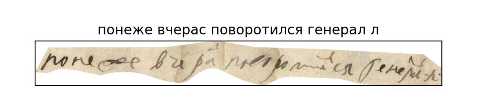
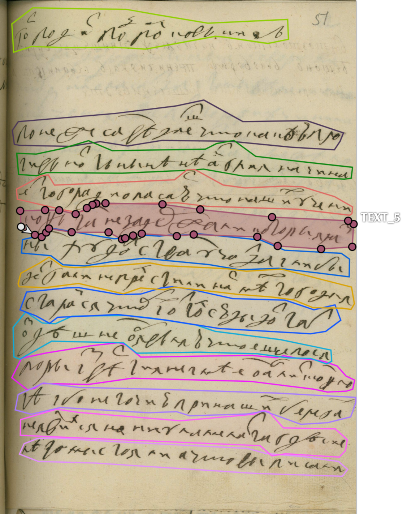
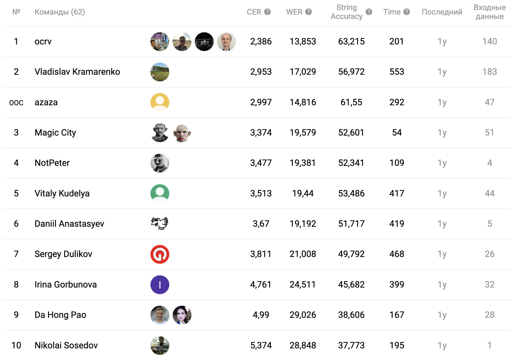

# DigitalPeter

[Link](https://huggingface.co/datasets/sberbank-ai/Peter) to HuggingFace repo of the Peter dataset (there you can download and read about the dataset).

## Description

The dataset consists of 9694 images and text files. There are 265788 symbols and approximately 50998 words.

<p align="center">
  
</p>

Each pair consists of one image file and one text file. File names have the format . Where  - is a document number,  - is a page number in the document ,  - is a line number in the page  of document . Such a naming system was created to help researchers who use our dataset to reconstruct original texts. One can train NLP models to help decrease the HTR model error.

Here is an example of one line of text.
<p align="center">
  
</p>


Here is an example of segmented document.
<p align="center">
  
</p>

## Train

Keras implementation of CNN-GRU-CTC model is presented in notebook [```baseline.ipynb```].

## Competition
We held a competition based on Digital Peter dataset.
Here is github [link](https://github.com/sberbank-ai/digital_peter_aij2020). Here is competition [page](https://ods.ai/tracks/aij2020) (need to register).

Here is the final leaderboard for this competition. Scores are presented for the private set. Baseline solution presented in this github has the following metric -  9,786	44,222	21,532 (CER,WER,ACC).
<p align="center">
  
</p>
