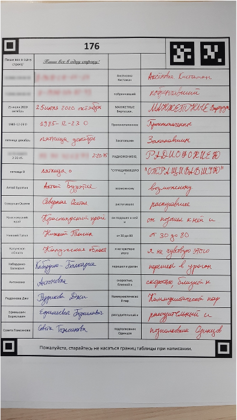
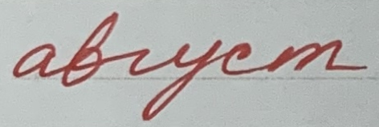

# Forms

 This dataset containts words and phrases written in special forms, like one on the picture. The final dataset contains cropped blocks of text from these forms and text annotations.

Example image from the dataset.

Here is the [link](https://drive.google.com/file/d/1XdDlbuOGaxodhFU_Bo9-zoZBguJE8oZD/view?usp=sharing). It contains `images` folder and `data.csv`. There are **5203** images in this dataset. Text corresponding to each image is in `text` column in `data.csv`.
