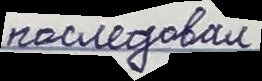
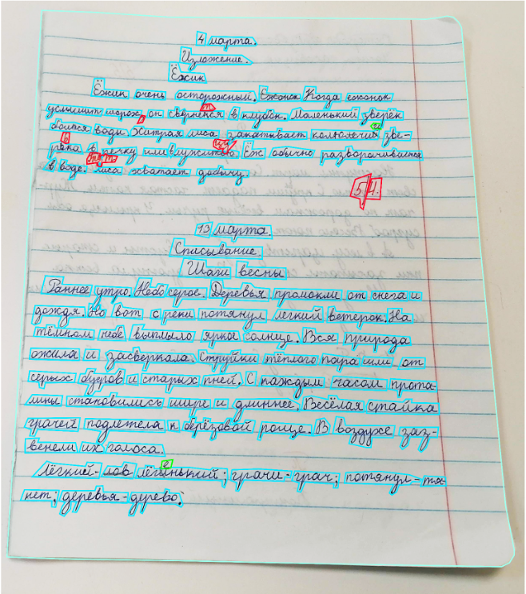
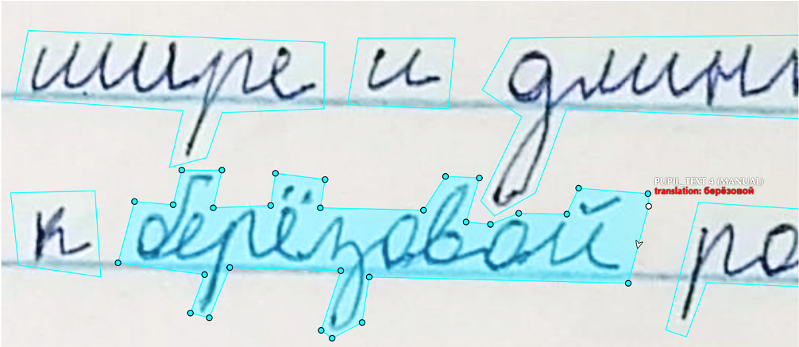

# school_notebooks

В данном репозитории содержится информация о датасете школьных тетрадей, который мы собрали 
и разметили для задачи распознавания рукописного текста. В данный момент мы не моем выложить 
полный размеченный датасет тетрадей, так как используем данные из него для проведения 
соревнований по машинному обучению. Но мы предоставляем ссылки для скачивания обучающей выборки из этих соревнований.

# Распознавание текста

Вот ссылка на соревнование [Fusion Brain Challenge](https://dsworks.ru/champs/fb5778a8-94e9-46de-8bad-aa2c83a755fb), `Данные - HTR train.zip`. Структура архива следующая:
* ```images``` - папка с изображениями в формате png
* ```train_labels.json``` - файл с правильным ответами. Это словарь, в котором ключом является названием
соответствующего изображения из папки ```images```, а значением - текст на данном изображении.

На данный размер датасета составляет 66599 картинок с переводом. На следующей картинке приведен
пример одного сэмпла из датасета. Соответствующий перевод - "последовал".



На следующей картинке представлен пример изначальной разметки школьной тетради  с помощью полигонов.



Затем каждое слово транскрибировалось отдельно.



# Детекция текста


Будет добавлено позднее.
